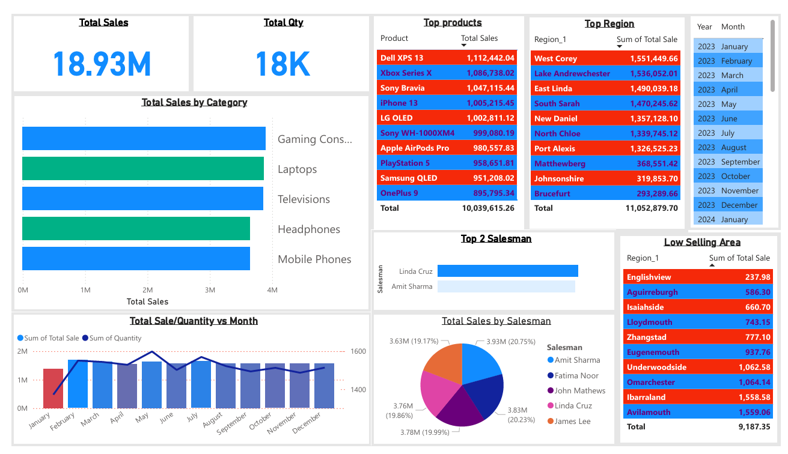

# Electronic Goods Sales Dashboard

This project demonstrates a dynamic sales dashboard built using **Excel** to analyze the performance of electronic products across different regions and sales representatives.

## 📊 Project Overview

The goal of this project is to:
- Visualize key sales metrics such as revenue, product performance, and regional distribution.
- Showcase skills in Power BI, DAX, and Excel automation.
- Provide actionable insights using real-world business scenarios.

## ✅ Features

- **Interactive Dashboard** with slicers for Region, Salesman, and Product.
- **DAX Measures** for KPIs including Total Sales, Units Sold, and Average Sales per Product.
- **Excel Integration** with Power Query for initial data cleaning and preprocessing.
- **Drill-through Pages** for detailed product and region-level insights.
- **Automated Workflows** using Excel formulas (where applicable).

## 🛠️ Tools Used

- **Power BI Desktop**
- **Excel (Advanced Formulas & Power Query)**
- **DAX**
- **Data Modeling**

## 📁 Files Included

- `SalesDashboard.pbix` – Power BI report file
- `SampleAnalysis.xlsx` – Cleaned sample sales dataset (electronic goods)
- `screenshots/` – Dashboard/Excel preview images

## 📷 Preview

## ⚙️ Data Description

The data used in this project is a **sample dataset** of electronic goods sales, containing:
- Product name and category
- Region
- Sales amount and quantity
- Salesperson details
- Dates of transaction

> 📌 *Note: This is sample data created for demonstration purposes only.*

## 👨‍💼 Author

**Ratheesh Panicker**  
📍 Dubai, UAE  
📧 rpnckr@gmail.com  
🔗 [LinkedIn](www.linkedin.com/in/ratheesh-panicker-3254481a0)  

